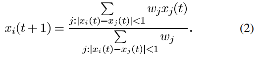

# On Krause’s Multi-Agent Consensus Model With State-Dependent Connectivity

> 作者：Vincent D. Blondel, Julien M. Hendrickx,  John N.   Tsitsiklis
> 机构：IEEE

## 研究问题 Research Question

### 科学问题 Science Question

主要是探讨了多主体系统中观点动态演化的模型，特别关注了观点之间的交互及集群形成。

### 研究核心 Core of the research

模型的稳定性和收敛性分析和集群形成和集群间距离的研究

### 研究意义 Research significance

为多主体系统中观点动态演化模型的理论研究提供了新的思路和方法，并通过理论分析和实验结果揭示了观点演化过程中的一些重要规律和现象

### 现有方法的不足 Shortcomings of existing algorithm

结果有局限性且缺乏普适性的证明，应用前景也不明确

### 结论 Conclusion

提出了一种稳定性分析方法，通过对观点动态演化模型中稳定性的理论推导和实证验证，展示了该方法的有效性和适用性。还讨论了观点动态演化模型的连续版本，并展示了连续模型与离散模型之间的关系，以及连续模型的一些性质和特点。最后，论文指出了现有方法的一些局限性和不足之处，并提出了未来研究的方向和改进的建议。

---

## 理论与方法 Theory and Method

### A

* #### 该论文主要使用的模型为

  ##### 其中xi(t)是代理 i 在时间 (或迭代次数) t 的观点值

  ##### j:|xi(t)-xj(t)|<1表示满足该条件（观点值差值至多为1）的代理i和代理j互为邻居，

  ##### xi(t+1)等于所有邻居的观点值的平均值

* ### 命题一：如果xi(0)≤xj(0),那么对于所有t，xi(t)≤xj(t)

  ##### 即每次迭代中xi(t)≤xj(t)恒成立，作者在此处证明使用了数学归纳法，他用Ni(t)表示所有代理i的集合，Nj(t)d代表所有代理j的集合，Nij(t)代表所有代理i和代理j的集合，对于任意k1∈Ni(t)，k2∈Nij(t)，k3∈Nj(t)，已知xi(0)≤xj(t)，易得xk1(t)≤xk2(t)≤xk3(t)，因此x̄Ni≤x̄Nij≤x̄Nj,即三个集合的平均数同样满足不等式，根据模型（1）可得
  
  ##### 其中论文使用|A|来表示集合A的基数，即集合元素的个数
  
  ##### 由此可得该模型一般性排列结论：当i<j时，xi(t)≤xj(t)
  
* #### 命题二：将x(t)排序，最小的x 1不会随迭代次数而变小，最大的x n不会随迭代次数而变大，如果在某一次迭代后xi(t)与xi(t+1)的距离大于或等于1，整个智能体系统将被分为两个子系统(一个是1~i，一个是i+1~n)

  ##### 与其他模型不同的是，该模型的意见值的平均值不一定会被保存，且方差偶尔会上升

  ##### 由此命题引出了定理一

* #### 定理一：假如x(t)出自于模型(1)，那么对于任何i，xi(t)都将在有限的次数内收敛到一个极限 xi\*, 此外，对于任意i和j，我们都会有xj\*=xi\*或|xj\*-xi\*|≥1(后者即为分为两个子系统的情况)

  ##### 作者在此处使用反证法，假设x(0)已被排序，隐含条件是此时X(0)相邻两个互为邻居。

  ##### 由于x 1不会随迭代次数增加而减小，且x n(0)为其上界，因此它会收敛到一个值x1\*,设p是x(0)收敛到x1\*的最大索引，即x 1到x p能收敛到x1\*，而x p+1及其之后的代理均不能收敛到x1\*

  ##### 作者需要证明如果p<n,将会有一次迭代会使xp+1(t)-xp(t)≥1，因此作者假设xp+1(t)-xp(t)<1恒成立，即该模型将始终为一个系统

  ##### 随后作者根据上述附加条件推导：
  
  ##### 设定某值ϵ>0，并选定一个时间点，在这时间点之后对于i从1到p，xi到x1\*的距离小于ϵ(|xi-x1\*|<ϵ)。因为xp+1不会收敛到x1\*，对于某值δ>0,将会有更多的迭代次数时xp+1>x1\*+δ
  
  ##### 对于这样的时间t，将会有xp(t+1)至少为
  
  ##### 且ϵ取足够小时，xp(t+1)>x1\*+δ，而这显然与xp能收敛到x1\*，且在此之前到x1\*的差值为ϵ相矛盾，进而推导出假设xp+1(t)-xp(t)<1显然不成立，因此证明存在一个时间t,使xp+1(t)-xp(t)≥1成立(分成两个子系统的前提)
  
  ##### 又根据命题二的结论，xp作为前子系统的最大值不会在后续迭代中变大，xp+1作为后子系统的最小值不会在后续迭代中变小，显然如果出现这一情况之后，xp+1(t)-xp(t)≥1将恒成立(分为两个子系统的必然性)
  
  ##### 由此两个系统将分别独立，并最终收敛的值至少相隔1
  
  ##### 收敛发生在有限次数内d的原因是代理的数量是有限的
  
  ##### 作者将能收敛到同一个值的代理集群称为簇
  
  ##### 收敛时间仅取决于n(代理数量)，n越大所需收敛时间越大
  
  ##### 作者在最后举出两个例子说明了定理一中集群收敛值间隔一定大于1不一定成立，但这种有待证明
  
  ### B
  
  ##### 作者提到集群的数量与初始观点所在范围长度L有关，基本表现为L越大集群数量越多，但集群不会超过L+1，且集群间隔均大于2，Fig.2很好的展现了这一现象，具体详见实验部分
  
  ##### 作者还提到对于更大规模的模拟，有一小部分的集群间隔会有过大或过小的现象，他认为大多是选择的特定离散化或不连续系统中数值误差的累积的原因
  
  ### C
  
  ##### 作者在这部分引入了权重部分，根据权重来更新代理的值
  
  ##### 模型更新为：
  
  
  
  ##### 是模型(1)的特殊形式
  
  ##### 而对于集群使用相同权重，集群的距离至少为2保持稳定
  
  ##### 作者提出如果任意小重量的扰动因子可以引起平衡的实质性变化，则平衡是不稳定的作者使用如下式子来度量扰动因子对收敛的影响，假设δ趋于0时，该式趋于零，则原收敛是稳定的
  
  
  
* #### 定理二：当且仅当任意两个群集A和B即它们的权重WA和WB满足两个条件之一：要么WA=WB且集群间距离大于等于2，要么WA≠WB且集群间距离必须大于1+min(WA,WB)/max(WA,WB),平衡是稳定的

  ##### 作者将扰乱因子引入代理中且至少与两个代理互为邻居

  

## 实验 Experiment

关键两个函数：

1、观点更新

~~~python
def update_opinions(opinions):# 更新代理观点
    new_opinions = np.zeros_like(opinions)
    for i, opinion in enumerate(opinions):
        neighbors = [neighbor for neighbor in opinions if abs(opinion - neighbor) < 1]
        if neighbors: # 如果存在邻居
            new_opinions[i] = np.mean(neighbors)
        else: # 如果不存在，则保持不变
            new_opinions[i] = opinion
    return new_opinions
~~~

2、迭代模拟

~~~python
def simulate_model(L, agents_num, max_t=15):#迭代模拟
    opinions = np.linspace(0, L, agents_num)  # 初始观点在[0, L]上均匀间隔
    opinion_t = []  # 存储每次迭代后的观点
    opinion_t.append(opinions.copy())
    for t in range(max_t):
        new_opinions = update_opinions(opinions)
        opinion_t.append(new_opinions.copy())
        opinions = new_opinions
    return np.array(opinion_t)
~~~

#### Fig.2：

##### 描述为：不同簇在平衡时的位置，对于一个L，有初始观点均匀分布在[0.L]的5000L智能体，及利表现出它们相对于L/2的位置。虚线表示初始观点在0到L分布的端点。

##### 该图可以很好的展现出智能体收敛的稳定性，直观体现出每个L智能体分散情况

##### 复现代码主要思想是循环遍历L，对每个L算出最终收敛的集合opinions，再遍历opinions通过计算每个智能体的邻居的平均数放入temp，放前检查是否有重复，迭代完后将所得的坐标画为散点图

##### 由于设备和耗时限制，我在此每个L仅用500L个智能体，L仅选取0到25，复现图如下：

#### Fig.3

##### 描述为：当初始意见在半无限区间上均匀分布时，每单位长度的密度为 100 的时间演化。代理组与其余代理分离，并收敛到相隔约 2.2 的集群

##### 复现代码采用上限为100进行迭代，图只选取0到8，传入参数L=100，agents_num=100*L,复现图如下：

#### Fig.4

##### 描述为：临时“元稳定”状态的示例。最初，形成了两个彼此不相互作用的群体，但它们都与介于两者之间的少数代理相互作用。结果，两组之间的距离缓慢减小，最终小于 1。在这一点上，这些群体直接相互吸引并合并成一个集群。

##### 复现代码传入参数L=4，agents_num=1000,复现图如下：

#### Fig.5

##### 描述为：一个收敛到稳定平衡状态的例子，其中集群间的距离小于2。初始的意见分布是通过在区间[0, 2.5]上取251个均匀间隔的意见，以及在区间[2.5, 3]上取500个均匀间隔的意见获得的。意见最终收敛到两个集群，分别有153和598个智能体，这两个集群之间相隔的距离是1.6138，大于1.2559（等于1加上153/598）。当使用更多的智能体时，如果初始意见以相同的方式分布，即区间[2.5, 3]上的密度是区间[0, 2.5]上密度的十倍，那么会得到类似的结果。

复现代码将初始意见按描述进行分布

~~~python
opinions = np.concatenate([np.linspace(0, 2.5, 251), np.linspace(2.5, 3, 500)])
~~~

复现图如下：

---

## 总结与思考 Summary and Reflections

这篇论文对观点动态演化模型的稳定性进行了深入研究，提出了一种新的稳定性分析方法，并展望了其在社会科学领域的应用前景。论文的成果对于推动社会系统稳定性研究的发展具有重要意义，结论的普适性和具体应用还有待研究